We review in this post the literature on Vision-Language Models for fine-grained images (documents).

Vision-Language Models, also known as "Multimodal Models" (with image and text as modalities), take an image as input (such as a document page or multiple document pages for multi-page document models) and a prompt as input (a question for QA, an instruction, or nothing for single-task models). These models process the input with a decoder (usually a language model) to return an output (the answer to a question for QA tasks, a response to an instruction for instruction-type inputs, a class for classification tasks, a JSON of entities extracted for entity extraction tasks, etc.). The architecture of VLMs includes an image encoder and a language model decoder, which takes both the image representation and text input (such as a question for QA or an instruction for instructional tasks). A projection layer (also called "Vision-Language Connector) is placed between the visual representation and the Language Model to convert the visual data into a format understandable by the LLM. This projection layer is trained using techniques like cross-attention, masked-language modeling, and image-text matching to link visual semantics with textual representations. This VLM structure is presented in this image from [Llava's paper](https://arxiv.org/pdf/2304.08485): 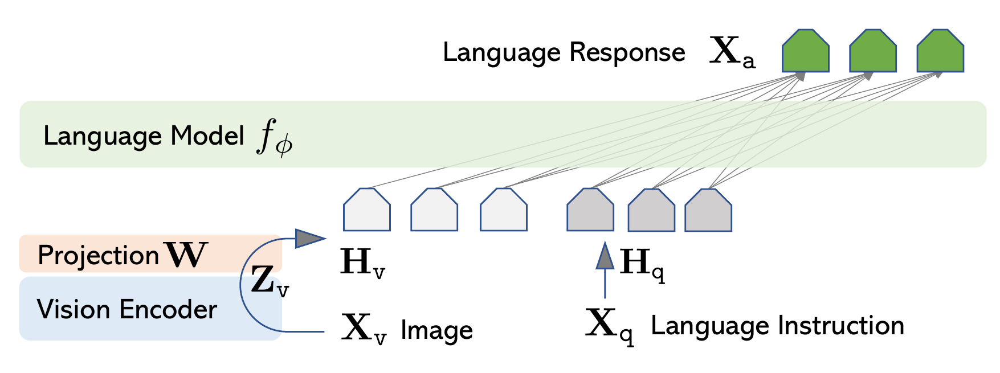 or here: 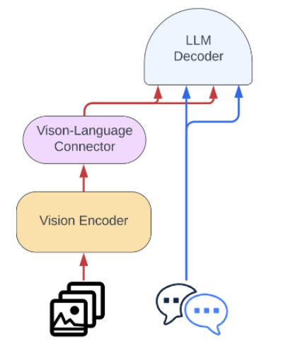, with a concrete example in [Llava1.5's paper](https://arxiv.org/pdf/2310.03744): 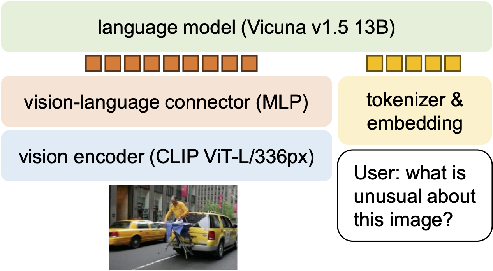.

Fine-grained images (in this context, documents) are images that contain text and numerous details (such as graphs, charts with text, etc.). In such images, each detail is crucial, and the images must be high-resolution since every detail (character, element in the image) matters, as opposed to natural images.

We can classify Visual-Language Models handling fine-grained images into three categories: those using low-grained vision models with an LLM as a decoder (1.) those using both (a fine-grained vision model and an LLM as a decoder) through various techniques (2.), and those using fine-grained vision models but a small language decoder (3.).

## 1. Models using low-grained vision model and a LLM as decoder

These models are classic vision-language models (not specialized for fine-grained images). To be capable of understanding fine-grained images, some classic vision-language models were trained on text-rich images.

These classic vision-language models work with a projection layer between the vision encoder and the LLM. Indeed, for the LLM to effectively understand and interact with the visual encoder's data, it is necessary that the representations generated by the encoder are in a format or context that is understandable to the LLM. This means that visual data must be transformed into a representation that makes sense in the linguistic domain. That's why an intermediary (a projection matrix) between the visual encoder and the LLM decoder is added. This projection layer helps to semantically align visual representations with textual representations. This means that similar visual concepts are mapped to close semantic spaces in the feature space of the LLM, thus facilitating the understanding and generation of language in relation to visual inputs. 

Can we take a pretrained vision encoder and LLM or should we fine-tune them to construct a VLM? And which Vision encoder / LLM to use?

Traditional VLMs use a pretrained ViT as vision encoder (either CLIP-ViT-H/L ([InternLM-XComposer2-4KHD](https://arxiv.org/pdf/2404.06512), [VL-Mamba](https://arxiv.org/pdf/2403.13600), [Ferret-UI](https://arxiv.org/pdf/2404.05719), [Vary](https://arxiv.org/pdf/2312.06109), [Llava-HR](https://arxiv.org/pdf/2403.03003), [Llava-UHD](https://arxiv.org/pdf/2403.11703), [UReader](https://arxiv.org/pdf/2310.05126), [UniDoc](https://arxiv.org/pdf/2308.11592), [LLaVAR](https://arxiv.org/pdf/2306.17107), [mPLUG-Owl](https://arxiv.org/pdf/2304.14178), [Llava](https://arxiv.org/pdf/2304.08485)), CLIP-ViT-BigG ([QwenVL](https://arxiv.org/pdf/2308.12966), [Monkey](https://arxiv.org/pdf/2311.06607)), EVA-CLIP ([BLIP2](https://arxiv.org/pdf/2301.12597), [MiniGPT4](https://arxiv.org/pdf/2304.10592), [CogAgent](https://arxiv.org/pdf/2312.08914)), SigLIP ([Tinychart](https://arxiv.org/pdf/2404.16635), [TextHawk](https://arxiv.org/pdf/2404.09204), [Idefics2](https://arxiv.org/pdf/2405.02246)), NFNet ([Flamingo](https://arxiv.org/pdf/2204.14198)), Swin Transformer ([DocPedia](https://arxiv.org/pdf/2311.11810), [DocParser](https://arxiv.org/pdf/2304.12484), [DONUT](https://arxiv.org/pdf/2111.15664), [Nougat](https://arxiv.org/pdf/2308.13418))...) and 7 or 13B LLMs, like Llama1-2 ([UReader](https://arxiv.org/pdf/2310.05126), [mPLUG-DocOwl1.5](https://arxiv.org/pdf/2403.12895), [Llava-HR](https://arxiv.org/pdf/2403.03003), [mPLUG-PaperOwl](https://arxiv.org/pdf/2311.18248), [mPLUG-DocOwl](https://arxiv.org/pdf/2307.02499)), InternLM1-2 ([InternLM-XComposer2-4KHD](https://arxiv.org/pdf/2404.06512), [TextHawk](https://arxiv.org/pdf/2404.09204)), Vicuna ([Ferret-UI](https://arxiv.org/pdf/2404.05719), [Llava-UHD](https://arxiv.org/pdf/2403.11703), [DocPedia](https://arxiv.org/pdf/2311.11810), [LLaVAR](https://arxiv.org/pdf/2306.17107), [MiniGPT4](https://arxiv.org/pdf/2304.10592), [Llava](https://arxiv.org/pdf/2304.08485)), Mistral ([Idefics2](https://arxiv.org/pdf/2405.02246)), Phi-2 ([Tinychart](https://arxiv.org/pdf/2404.16635)), OPT ([BLIP2](https://arxiv.org/pdf/2301.12597), [Vary](https://arxiv.org/pdf/2312.06109)), Qwen ([Monkey](https://arxiv.org/pdf/2311.06607), [TextMonkey](https://arxiv.org/pdf/2403.04473), [QwenVL](https://arxiv.org/pdf/2308.12966)) or FlanT5XXL ([BLIP2](https://arxiv.org/pdf/2301.12597)) (chat / instruct versions). 

The paper [What matters when building vision-language models?](https://arxiv.org/pdf/2405.02246) has shown that for a fixed number of parameters, the quality of the language model has a higher impact on the performance of the final VLM than the quality of the vision encoder.

How the projection layer works?

As shown in the paper [What matters when building vision-language models?](https://arxiv.org/pdf/2405.02246), there are 2 types of projection layer: (1) the cross-attention architectures, in which the encoding of the image is injected at different layers within the language model by interleaving cross-attention blocks in which the text cross-attends to the image hidden states, and (2) the fully autoregressive architectures in which the encoding of the image is directly concatenated to the sequence of text embeddings, and the entire sequence is passed as input to the language model.

The cross-attention architecture (1) of the projection layer is depicted in the Q-Former layer, implemented in [BLIP-2](https://arxiv.org/pdf/2301.12597), [MiniGPT-4](https://arxiv.org/pdf/2304.10592) and [InstructDr](https://arxiv.org/pdf/2401.13313) as a "Document-Former", which employs a specific attention masking strategy to control the interaction between query and text tokens, ensuring a comprehensive and contextually relevant representation as presented in 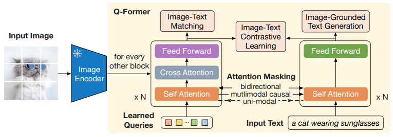, as well as in the Perceiver Resampler layer, implemented in [Flamingo](https://arxiv.org/pdf/2204.14198), [Kosmos 2.5](https://arxiv.org/pdf/2309.11419), and [Monkey](https://arxiv.org/pdf/2311.06607) as a "shared resampler", which uses cross-attention layer between text and visual tokens as depicted in 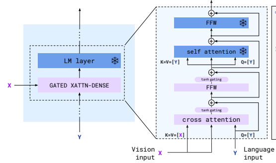. 

The fully autoregressive architectures (2) is depicted in the linear projection layers from [Llava](https://arxiv.org/pdf/2304.08485), [LLaVAR](https://arxiv.org/pdf/2306.17107), [UniDoc](https://arxiv.org/pdf/2308.11592), [DocPedia](https://arxiv.org/pdf/2311.11810), [Vary](https://arxiv.org/pdf/2312.06109), [Tinychart](https://arxiv.org/pdf/2404.16635), [InternLM-XComposer2-4KHD](https://arxiv.org/pdf/2404.06512) and [Idefics2](https://arxiv.org/pdf/2405.02246) which project linearly the visual representation to another space and then this transformed representation is concatenated with the textual input and fed into the language model, as well as in the Visual Abstractor Layer, implemented in [mPLUG-Owl](https://arxiv.org/pdf/2304.14178), [mPLUG-DocOwl](https://arxiv.org/pdf/2307.02499), [mPLUG-PaperOwl](https://arxiv.org/pdf/2311.18248) and [UReader](https://arxiv.org/pdf/2310.05126), which concatenates a selection of image patchs (done through the addition of learnable tokens interracting with visual patchs through cross-attention mechanism) to textual tokens, as well as in the H-Reducer layer, implemented in [mPLUG-DocOwl1.5](https://arxiv.org/pdf/2403.12895), which concatenated the reduced representation of the endoded image (convolution techniques) to the text representation, and the concatenated result is then fed to the LLM. 

The paper [What matters when building vision-language models?](https://arxiv.org/pdf/2405.02246) has shown that the cross-attention architecture (1) performs better than the fully autoregressive one (2) when pre-trained Vision and Language models are kept frozen. However, when fine-tuning them, the fully autoregressive architecture outperforms the cross-attention one, even though the latter has more parameters.

Below are some examples of classic vision-language models:



These classic Vision-Language Models are trained on natural images to perform tasks such as image-based question answering. However, to adapt them to text-rich images like documents (the data is way less abundant than natural images), some work have fine-tuned these vision-language models on datasets containing text-rich images such as documents. Here are some examples of classic vision-language models fine-tuned on text-rich data:



## 2. Models using fine-grained vision model and a LLM as decoder

The computational complexity of LLMs in terms of the input sequence length \( n \) can be expressed as \( O(n^2) \), with the complexity arising from pairwise comparisons between elements in the sequence. However, the more fine-grained (high resolution) image the visual encoder takes, the longer will be its representation by the visual encoder, so the input sequence length taken by the visual encoder increases, so the more time it takesat inference of the LLM, without saying that LLMs have input sequence length limit. However, the higher the resolution the image is, the better performance will have the vision language model on fine-grained tasks. Here is this illustration made by [Pix2Struct's paper](https://arxiv.org/pdf/2210.03347) on Vision-Language model performance on DocVQA task (ANLS score) depending on the input sequence length (and so on the number of pixel of the image): 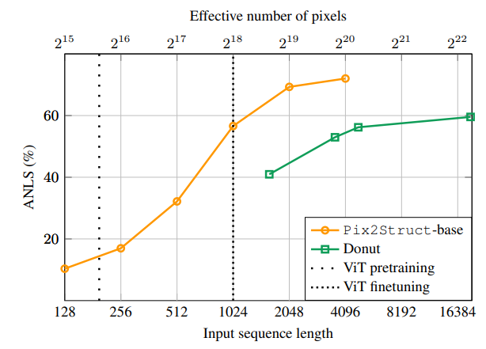

This is why models using LLMs as decoder often use a smaller representation visual encoder than the vision-rich models.

However, some papers use some tips to use LLM as decoder and a fine-grained representation of the input image (document) by the model. 

Here are papers relating some tips to do so: 



And here is a summary of those tips:

Slicing high-resolution image into several crops

By dividing an image into multiple crops, a low-resolution Vision Transformer (ViT) can be utilized, reducing the input size for the large language model (LLM) while still enabling fine-grained analysis.

[SPHINX](https://ar5iv.labs.arxiv.org/html/2311.07575) crops high-resolution documents into four 224x224 pixel sub-images and includes a low-resolution version of the entire image. These slices and the full image are encoded separately with four visual encoders (CLIP-ViT, CLIP-ConvNeXt, DINOv2-ViT, BLIP2) and then concatenated for the large language model (LLM) input 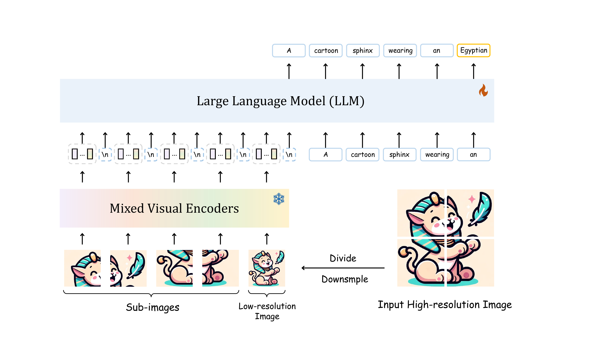. [UReader](https://arxiv.org/pdf/2310.05126) employs an adaptive cropping module to divide high-res images into local images based on predefined grids, selecting the best grid via resolution coherence and shape similarity calculations​​ 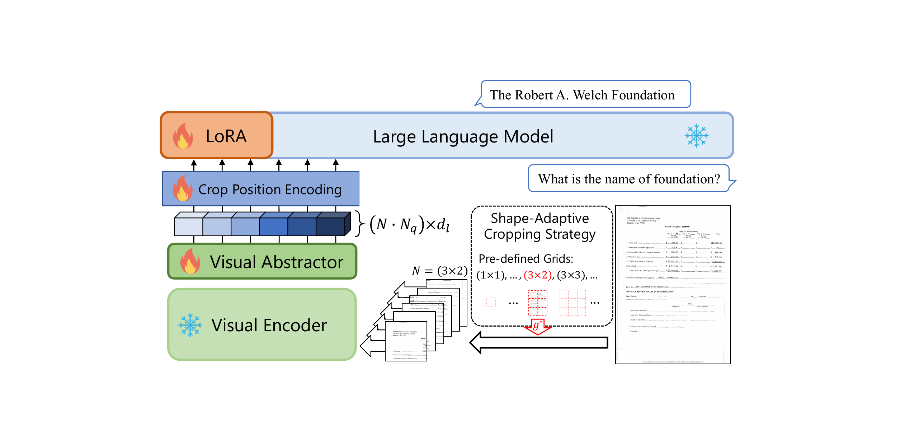 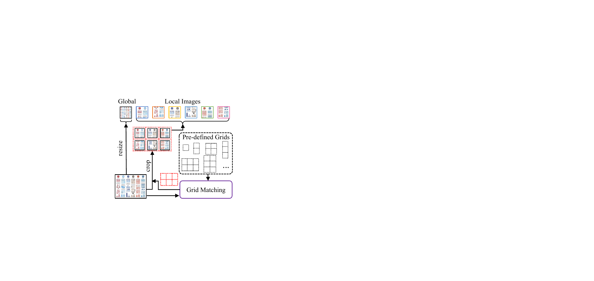. [Monkey](https://arxiv.org/pdf/2311.06607) uses a Swin Transformer-inspired sliding window to split images into crops​​ 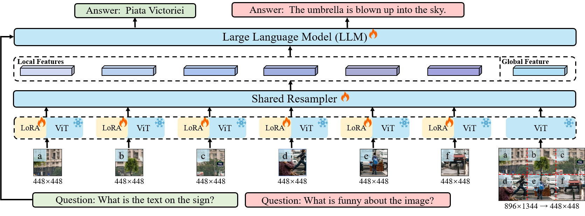. [TextMonkey](https://arxiv.org/pdf/2403.04473) enhances this with shifted window attention and a token resampler for better slice connections within the Vision Transformer (ViT) 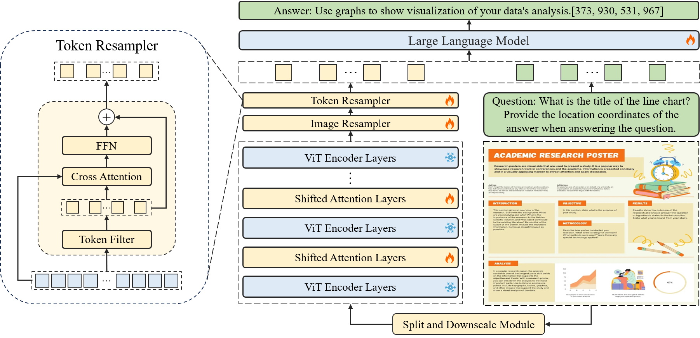. [mPLUG-DocOwl1.5](https://arxiv.org/pdf/2403.12895) adopts adaptive cropping and adds textual tokens to visual features, using an H-Reducer projection matrix to maintain slice positions​​ 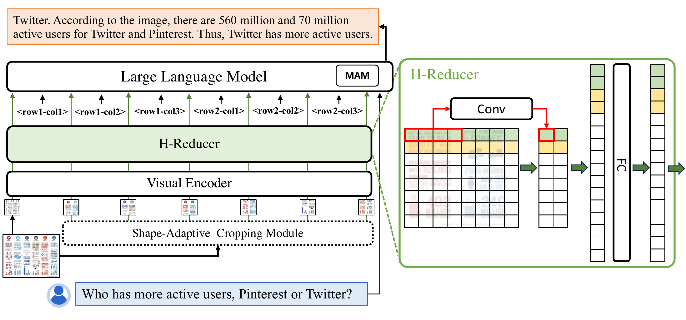. [LLaVA-UDH](https://arxiv.org/pdf/2403.11703) introduces image-modularization, slicing images into variable-sized crops and selecting the optimal partition to align with ViT's standard configuration​​ 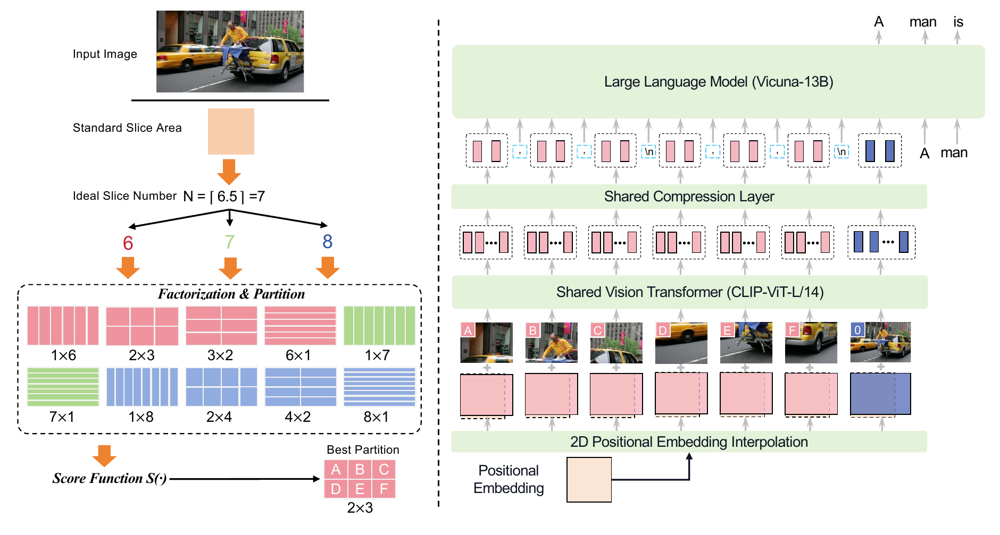. [InternLM-XComposer2-4KHD](https://arxiv.org/pdf/2404.06512) dynamically partitions images into non-overlapping 336x336 pixel slices and adds a learnable newline token to preserve global structure​ 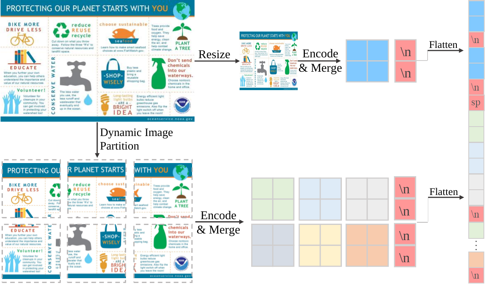. [TextHawk](https://arxiv.org/pdf/2404.09204) utilizes adaptive cropping similar to UReader but includes a Scalable Positional Embedding (SPE) module to adjust positional embeddings based on slice count, ensuring consistent positional information for downstream tasks​. [Idefics2](https://arxiv.org/pdf/2405.02246) employs a pooling layer, so that the sequence of visual tokens is pooled into a shorter sequence.

Reduction of Vision Embedding Sequence (post-processing)

Another method involves reducing the sequence length of the high-resolution image embedding after it has been generated by the visual encoder, thereby providing a smaller input size to the large language model (LLM).

One effective approach to reducing the sequence length of visual embeddings is transforming the image into the frequency domain. [DocPedia](https://arxiv.org/pdf/2311.11810) implements this technique by converting high-resolution visual encoder outputs into the frequency domain, similar to a Fourier transformation. This method separates high-level information, such as object structures and contours crucial for semantic understanding, from low-level details like texture and noise. By emphasizing important features and minimizing noise, this approach streamlines visual data processing. For instance, [FrequencyViT](https://openaccess.thecvf.com/content/WACV2023/papers/Li_Discrete_Cosin_TransFormer_Image_Modeling_From_Frequency_Domain_WACV_2023_paper.pdf) uses the Discrete Cosine Transform (DCT) to convert images into the frequency domain before feeding them into the Vision Transformer. This process breaks down the image into blocks and measures the energy in each block. These measurements, or "DCT coefficients," provide a concise representation of the image's energy distribution across luminance and chrominance channels, allowing for high-resolution image processing with a shorter representation sequence.

Another effective approach involves implementing a sampler-based module to reduce the dimensionality of visual embeddings. Many papers use a pooling layer to reduce the sequence length of the visual embedding ([Kosmos 2.5](https://arxiv.org/pdf/2309.11419), [Idefics2](https://arxiv.org/pdf/2405.02246) and [TextHawk](https://arxiv.org/pdf/2404.09204)). Another method to reduce the image representation dimension involves the use of learnable tokens added to image patches. These tokens serve as summarizers of visual information, allowing the model to obtain higher semantic visual representations while reducing computational load. In the Q-Former layer, implemented in [BLIP-2](https://arxiv.org/pdf/2301.12597), [MiniGPT-4](https://arxiv.org/pdf/2304.10592) and [InstructDr](https://arxiv.org/pdf/2401.13313) as a "Document-Former", these learnable tokens are used to capture and distill essential visual features through a process of cross-attention with the image patches, helping to extract the most relevant visual information that aligns with the textual input. Similarly, the Perceiver Resampler layer, implemented in [Flamingo](https://arxiv.org/pdf/2204.14198), [Kosmos 2.5](https://arxiv.org/pdf/2309.11419), and [Monkey](https://arxiv.org/pdf/2311.06607) as a "shared resampler", employs learnable tokens that directly interact with image patches via cross-attention mechanisms, summarizing the visual content into a smaller set of embeddings. Another method for dimensionality reduction of visual embedding is through the use of convolution techniques. [mPLUG-DocOwl1.5](https://arxiv.org/pdf/2403.12895) employs H-Reducer as projection layer, which uses convolutional techniques to shorten the sequence length while preserving horizontal semantic coherence, making it particularly effective for text-heavy images, as presented in 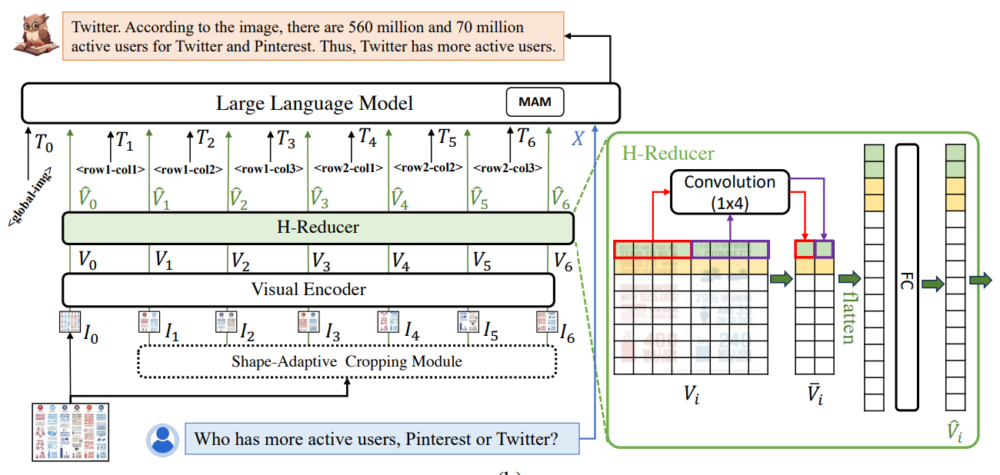.

Another effective way to reduce the dimensionality of visual embeddings is through token selection techniques. [Tinychart](https://arxiv.org/pdf/2404.16635) implements a visual token merging method, which is particularly useful for charts containing many similar color blocks and blank spaces. This method merges the \(r\) most similar token pairs, reducing the vision feature sequence length by \(r\) in each layer. Following the token merging strategy from [ToMe](https://arxiv.org/pdf/2210.09461), similarity between tokens is measured using the cosine distance between Keys from self-attention. Tokens are divided into two sets, with each token in one set paired with its most similar token in the other set, merging features through average pooling. When tokens representing multiple patches are merged, the attention mechanism is adjusted to account for the new token 'size'. This is done by adding \(\log s\) to the attention scores, where \(s\) is a vector indicating the size of each token. This adjustment ensures the attention mechanism reflects the actual information each token represents, maintaining balanced and accurate attention distribution.

Dual approach: high and low resolution images handled in parallel

A first way to do so is to do a dual encoding of the image: with low and high resolution. [CogAgent](https://arxiv.org/pdf/2312.08914) employs this by using large pretrained Vision-and-Language Models (VLMs) and high-resolution small Vision Transformers (ViTs). The document image is resized to high-resolution (1120×1120) and low-resolution (224×224), processed in parallel by different-sized image encoders. The low-resolution encoder is part of the pretrained large VLM, CogVLM, which includes an EVA2-CLIP-E encoder with an MLP adapter and uses Vicuna-7b as the decoder. In parallel, the high-resolution input is handled by a smaller ViT and cross-attention layers. Only the high-resolution module is trained, leveraging the small ViT's ability to process higher resolution images due to its quadratic memory complexity advantage. Similarly, [Mini-Gemini](https://arxiv.org/pdf/2403.18814) uses a pretrained CNN as the high-resolution encoder and a CLIP-pretrained ViT for low-resolution. It combines low and high-resolution embeddings through a "Patch Info Mining" module using cross-attention. [LLaVA-HR](https://arxiv.org/pdf/2403.03003) adopts a similar approach, with MR-Adapters embedding high-resolution visual information into the low-resolution modeling to capture fine-grained semantics.

A second approach is to have a dual network (not only dual vision encoder) : a fine-grained encoder with tiny decoder and low-resolution encoder with LLM. This is what Vary \cite{vary} does. Vary consists of two distinct components: a "vision vocabulary network," which features a high-resolution visual encoder (Pretrained ViTDet (\cite{vitdet})) and a tiny decoder (OPT-125M), and a classical MLLM that includes a low-resolution visual encoder (CLIP) and a Large Language Model as the decoder (Vicuna-7b). The fine-grained encoder with the tiny-decoder is trained autoregressively, focusing on next-token prediction, which enhances the high-resolution visual embedding. This embedding is then added to the frozen encoder of the MLLM, a process Vary refers to as "vocabulary expansion". With this method, Vary aims to ensure its enhancements to CLIP do not introduce noise when processing natural images, thereby effectively expanding the model's capabilities in fine-grained perception tasks.

Another approach involves using a dual network setup with both a fine-grained encoder and a low-resolution encoder paired with a large language model (LLM). This method is exemplified by [Vary](https://arxiv.org/pdf/2312.06109), which consists of two components: a "vision vocabulary network" with a high-resolution visual encoder (Pretrained ViTDet) and a tiny decoder (OPT-125M), and a traditional MLLM comprising a low-resolution visual encoder (CLIP) and an LLM (Vicuna-7b). The fine-grained encoder and tiny decoder are trained autoregressively for next-token prediction, enhancing the high-resolution visual embedding. This enhanced embedding is then integrated into the frozen encoder of the MLLM, a technique Vary calls "vocabulary expansion". This ensures that improvements to CLIP do not introduce noise when processing natural images, thereby expanding the model's capabilities in fine-grained perception tasks.

## 3. Models using fine-grained vision model and a small Language Model as decoder



