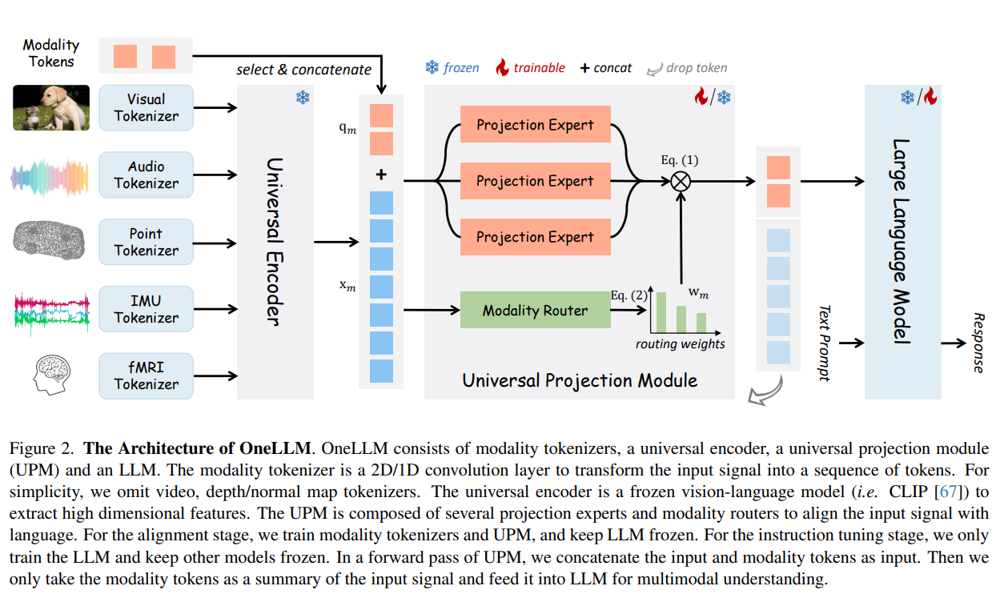
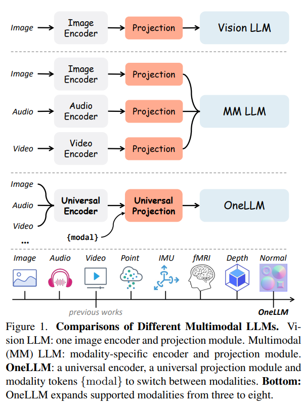

---

Résumé du papier [OneLLM: One Framework to Align All Modalities with Language](https://arxiv.org/pdf/2312.03700.pdf).

# Modèles de langage multimodaux (MLLMs) : 
Attention significative pour leur capacité à comprendre plusieurs modalités.
# Travaux existants : 
Dépendance aux encodeurs spécifiques à chaque modalité, limités aux modalités communes.
# OneLLM : Alignement de huit modalités avec le langage utilisant un cadre unifié. Composants clés : 
encodeur multimodal unifié, pipeline d'alignement multimodal progressif.
# Performances : 
Évaluation sur 25 benchmarks variés, excellente performance dans des tâches comme la légende multimodale, les questions-réponses, et le raisonnement.
# Modèles vision-langue : 
Modèles comme Flamingo et BLIP2 intégrant des caractéristiques visuelles dans les LLMs.
# Modèles de langage multimodaux (MLLMs) : 
Combinaison de plusieurs modalités (image, audio, vidéo), mais limités aux modalités courantes.
# Références spécifiques : 
Mention de modèles tels que X-LLM et ChatBridge, qui utilisent des encodeurs pré-entraînés pour images, vidéos et audio.
# Défis actuels : 
Difficulté d'alignement des modalités diverses dans un cadre unifié.
# Benchmarks utilisés : 
Large gamme de tâches évaluées, telles que la génération de légendes multimodales et les questions-réponses.
# Configuration expérimentale :
Détails sur les données, les métriques d'évaluation et la configuration de l'expérience.

